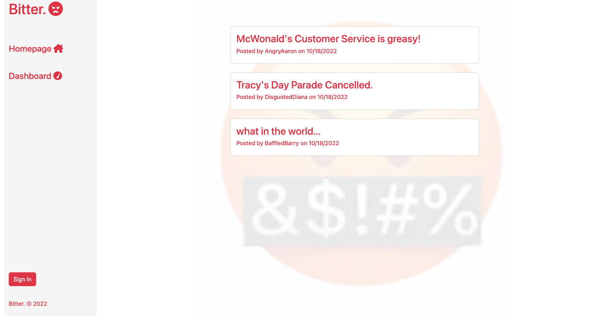

# Bitter

## Table of Contents
* [Description](#description)
* [Installation instructions](#installation-instructions)
* [Usage Information](#usage-information)
* [License](#license)
* [Contribution Guidelines](#contribution-guidelines)
* [Test Instructions](#test-instructions)
* [Questions](#questions)

## Description
Bitter is the better blog site to really let the world know what grinds your gears! This app follows the MVC paradigm in its architectural structure, using Handlebars.js as the templating language, Sequelize as the ORM, and the 'express-session' npm package for authentication. 

## Installation Instructions
Install Node.js before using this application.

## Usage Information
[Click here to check it out!](https://the-bitter-blog.herokuapp.com/)

## License
[MIT](https://opensource.org/licenses/MIT)

## Contribution Guidelines
N/A

## Test Instructions
N/A
